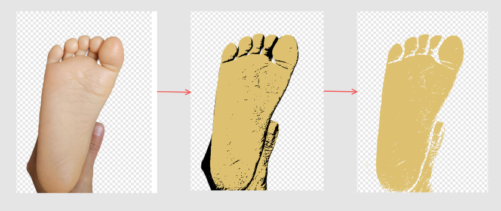
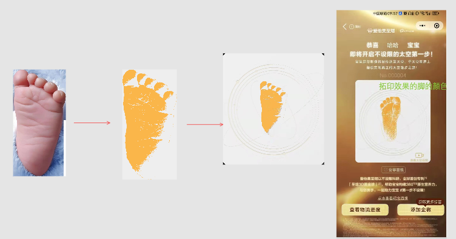

# Foot Pattern Generator

This Java program uses OpenCV to process foot images and generate a golden footprint image with foot texture.

 

## Project Description

The project reads foot images, separates the foot from the background, and creates a golden pattern with clear foot texture.

## Features

- Advanced foot detection and segmentation
- Background removal
- Enhanced and preserved foot texture
- Golden footprint generation
- Circular background design

## How to Build and Run

1. Ensure that Java 11+ and Maven are installed.
2. Build the project: `mvn clean package`
3. Run the program: `mvn exec:java`

The program will:
1. Read the input image: `/workspace/foot_cv/1.png`
2. Process the image to generate a foot texture pattern
3. Save the result to: `/workspace/foot_cv/result.png`

## Dependencies

- OpenCV 4.5.1-2 (via org.openpnp:opencv)

## License

apache 2.0
